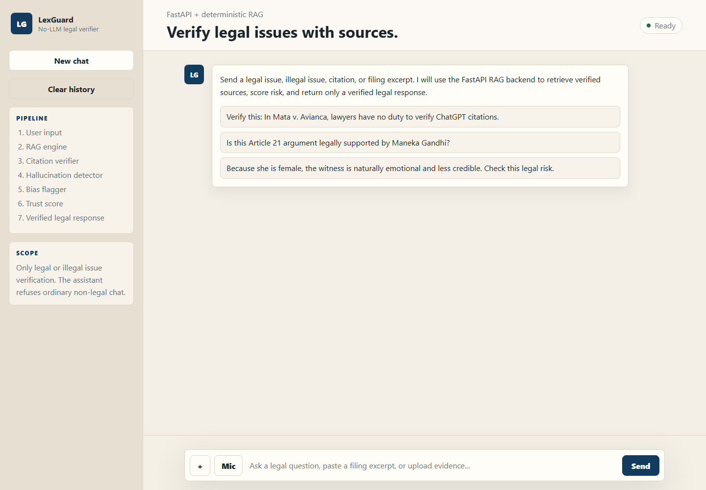

# Hallucination-Resistant Legal Research Assistant



LexGuard is a no-LLM legal verification chatbot. It looks like a normal chatbox, but the answer comes from a FastAPI backend that retrieves verified legal sources, checks citations, detects hallucination risk, flags bias, and returns a trust score.

## What it does

- ChatGPT-style legal chat UI
- Accepts typed questions, pasted legal text, photos, images, videos, audio, PDFs, Word files, and text documents
- Uses a deterministic RAG engine instead of an LLM
- Answers only legal or illegal issue verification requests
- Refuses normal non-legal chat
- Verifies detected legal citations against the local corpus
- Flags unsupported dates, invented rulings, unsafe absolute legal claims, and identity-based bias
- Produces a score with `High Risk`, `Needs Review`, or `Verified`
- Saves chat history in the browser and also stores backend analysis history locally in `data/history.json`
- Includes Vercel deployment configuration

## Run locally

Create and activate a Python environment, then install the backend packages:

```bash
pip install -r requirements.txt
```

Start the FastAPI app:

```bash
uvicorn backend.app.main:app --reload --port 8000
```

Open:

```text
http://localhost:8000
```

## Test

```bash
python -m unittest discover tests
```

## API

```text
GET    /health
POST   /api/analyze
GET    /api/history
DELETE /api/history
```

`POST /api/analyze` accepts multipart form data:

```text
message: legal question or text
files: optional uploaded files
```

## Project structure

```text
api/index.py             Vercel FastAPI entrypoint
backend/app/main.py      FastAPI app and API routes
backend/app/legal_engine.py
                         RAG retrieval, verification, scoring, response generation
backend/app/corpus.py    Verified legal corpus
backend/app/history.py   Local JSON history store
index.html               Chat UI shell
src/app.js               Browser chat, uploads, audio recording, history
src/styles.css           Responsive chat styling
requirements.txt         FastAPI dependencies
vercel.json              Deployment routing
tests/                   Engine tests
```

## Deploy on Vercel

Install and login to the Vercel CLI:

```bash
npm i -g vercel
vercel login
```

Deploy from the project folder:

```bash
vercel --prod
```

Vercel will serve the static chat UI and route `/api/*` requests to the FastAPI app.
